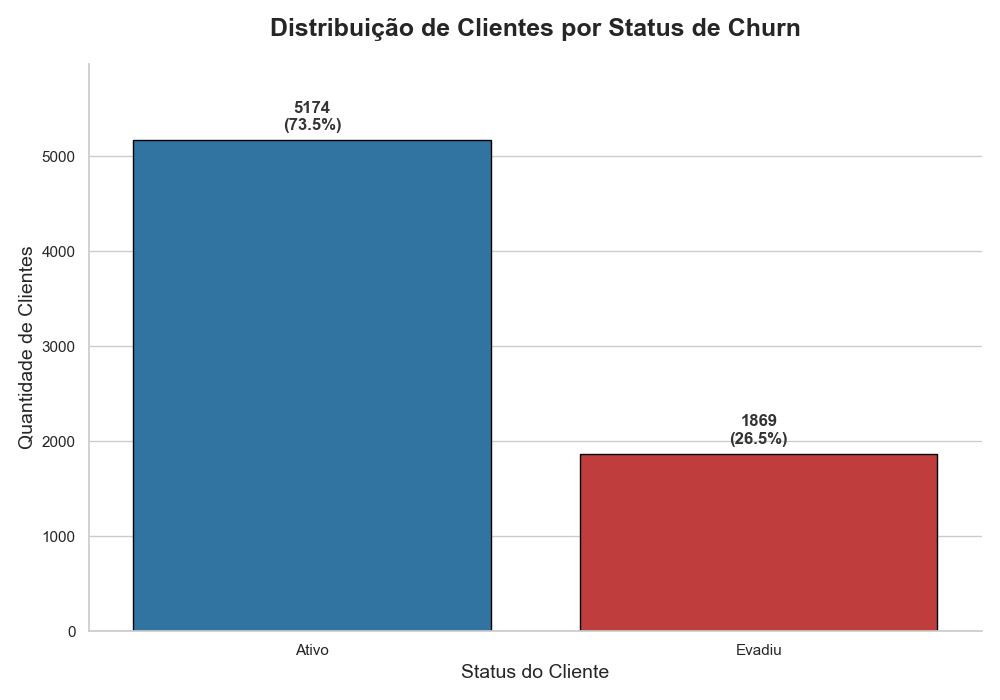
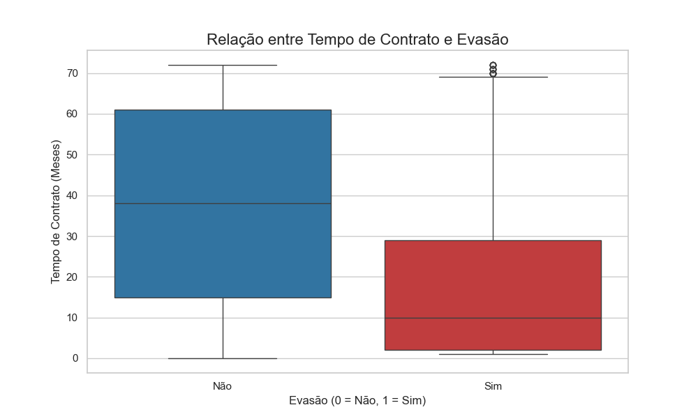
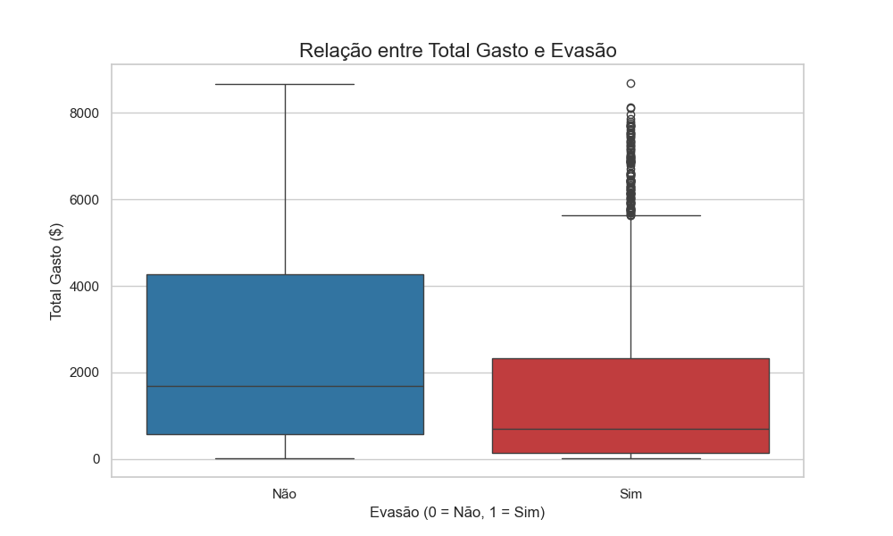
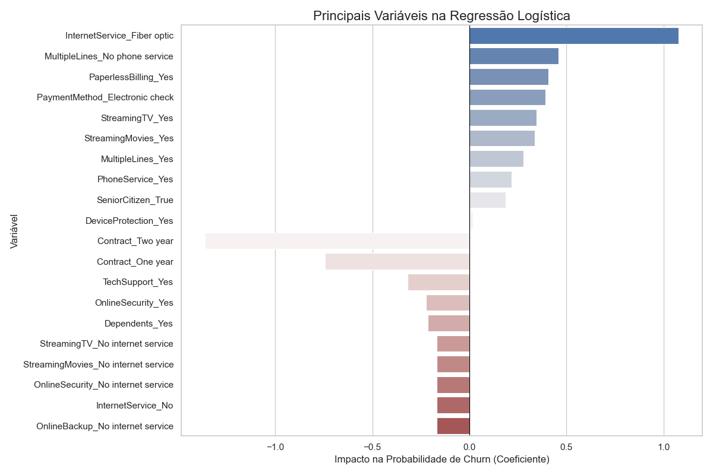
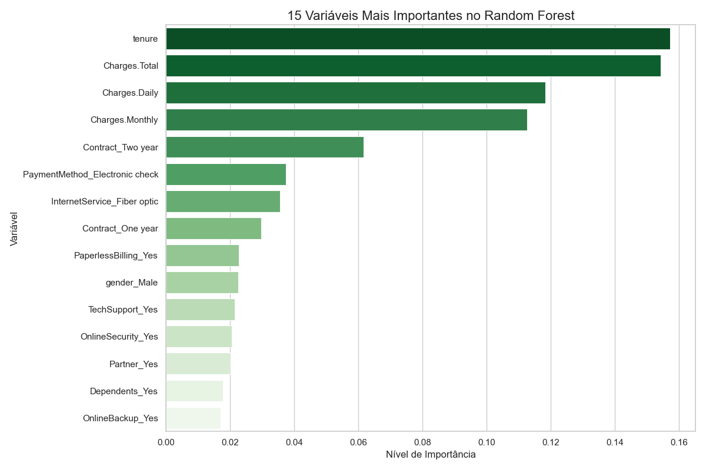

# 📊 Telecom X – Parte 2: Prevendo Churn de Clientes

## 🧠 Descrição do Projeto
Este projeto utiliza modelos preditivos para identificar clientes com maior probabilidade de cancelar seus serviços (churn) na Telecom X, além de apontar os principais fatores que influenciam a evasão.

## 🎯 Principais Insights

### Distribuição de Churn

### Relação entre Tempo de Contrato e Evasão

### Relação entre Total Gasto e Evasão

### Importância das Variáveis na Regressão Logística

### Importância das Variáveis no Random Forest

---

### 1. Fatores de Risco (Aumentam o churn)
- **Contrato Mensal (Month-to-month):** Maior risco de evasão devido à flexibilidade.
- **Fibra Óptica (InternetService_Fiber optic):** Clientes desse serviço estão mais propensos a cancelar, possivelmente por preço ou instabilidade.
- **Cobranças Mensais Elevadas (Charges.Monthly):** Alta sensibilidade ao preço.
- **Pagamento com Cheque Eletrônico:** Método não automático pode aumentar cancelamentos.

### 2. Fatores de Proteção (Diminuem o churn)
- **Tempo de Contrato (tenure):** Clientes antigos têm menor probabilidade de sair.
- **Contratos de 1 e 2 anos:** Barreiras eficazes contra evasão.
- **Gasto Total (Charges.Total):** Alto valor de vida reduz churn.
- **Serviço de Internet DSL:** Menor taxa de churn comparado à fibra.

### 3. Modelos e Desempenho
- **Regressão Logística:** Recall de 80% para churn, ideal para campanhas de retenção em massa.
- **Random Forest:** Maior precisão (63%), mas recall menor (47%), indicado para campanhas de alto custo e foco em certeza.

| Modelo               | Acurácia | Precisão | Recall | F1-score |
|----------------------|----------|----------|--------|----------|
| Regressão Logística  | 73%      | 50%      | 80%    | 0.61     |
| Random Forest        | 79%      | 63%      | 47%    | 0.54     |

**Decisão:** Regressão Logística escolhida como modelo principal devido ao alto recall.

### 4. Estratégias de Retenção Propostas
- Migrar clientes de contrato mensal para contratos mais longos com benefícios.
- Programa de onboarding e fidelização nos primeiros meses.
- Investigar causas de churn na fibra óptica (suporte, NPS, performance).
- Ofertas proativas para clientes sensíveis ao preço.

## 🚀 Conclusão
A ferramenta preditiva desenvolvida permite identificar e agir sobre clientes em risco, orientando estratégias para reduzir churn e aumentar a lealdade.

Projeto desenvolvido por [Jeffeson Noronha](https://github.com/jeffnoronha1).
